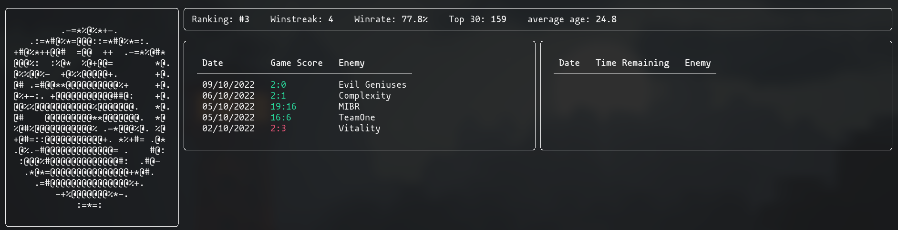

# HLTVTerminal

This is a small terminal programm i made to display some team information available on HLTV using python.

It displays:
- The team logo (has to be added manually)
- General stats (ranking, winsreak, winrate, time spend in top 30, average player age)
- previous matches (date, score, enemy)
- upcoming matches (date, time remaining, enemy)

